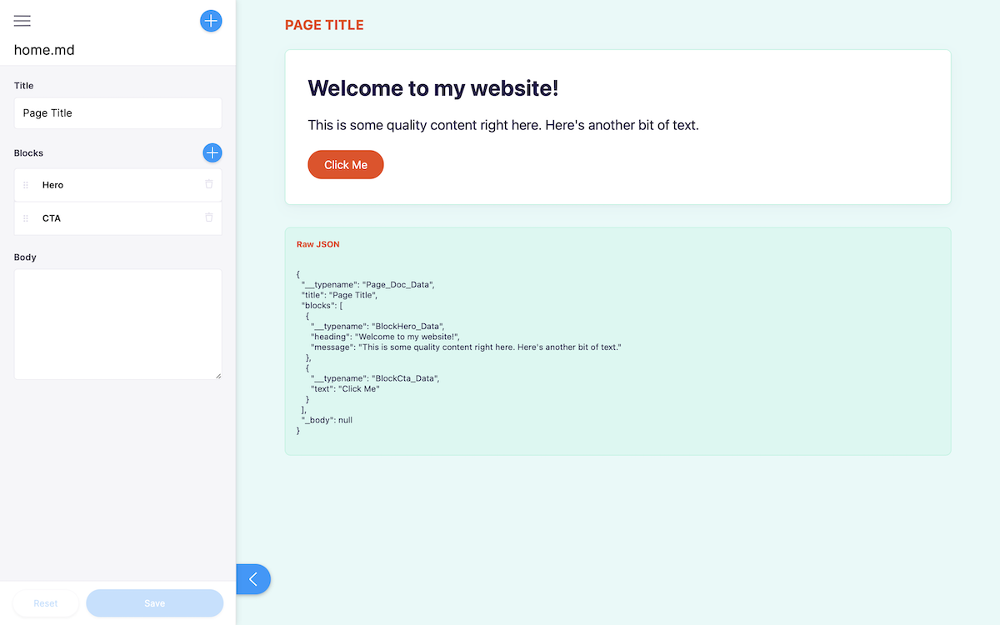
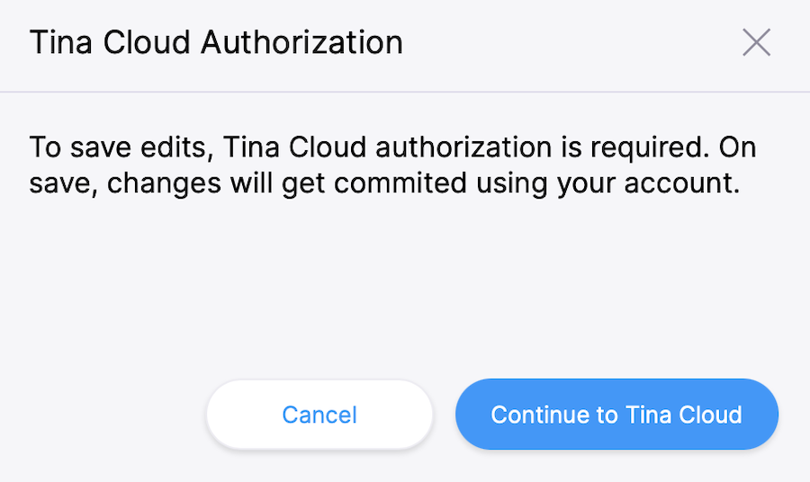
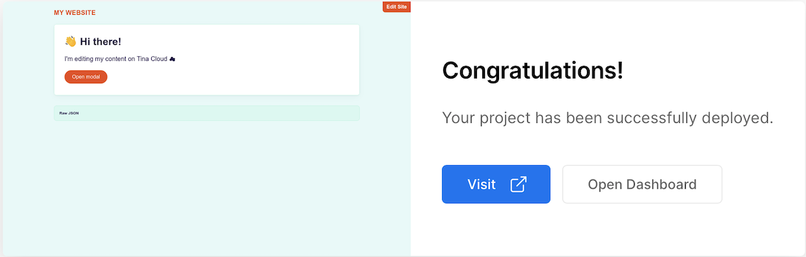
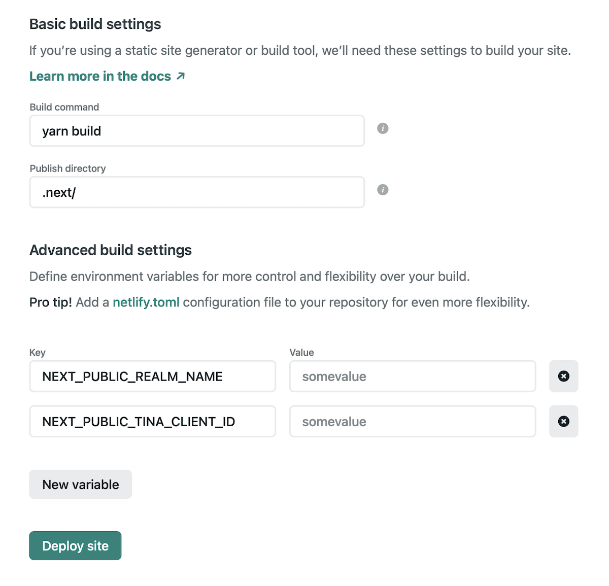

# Tina Cloud Starter 🦙

Basic TinaCMS starter based on [Next.js](https://nextjs.org) and [TinaCMS](https://tina.io) that connects to Tina Cloud Content API.



## Project scope:

- Run this project locally using local content within this repository.
- Connect to Tina Cloud to benefit from its GraphQL Content API.
- Deploy the site to visually edit your site.
- Invite collaborators 🔜.

## Table of contents

- 🍴 [Fork and Clone](#fork-and-clone-this-repository)
- ⬇️ [Install](#install)
- 🌎 [Run the project locally](#run-the-project-locally)
- 📝 [Edit content locally](#edit-content-locally)
- 🦙 [Connect to Tina Cloud](#connect-to-tina-cloud)
  - ☁️ [Register your local application with Tina Cloud](#register-your-local-application-with-tina-cloud)
  - 🔌 [Connect your local project with Tina Cloud](#connect-your-local-project-with-tina-cloud)
  - 📝 [Edit content](#edit-content)
- ⬆️ [Deploy](#deploy)
  - ▲ [Vercel](#vercel)
  - [Netlify](#netlify)
- 🗂 [Starter structure](#starter-structure)
- 📐 [Content Modeling](#content-modeling)
- 💡 [Local development workflow tips](#local-development-workflow-tips)

## Fork and clone this repository

First fork and clone this repository on your computer.

## Install

> ℹ️ This project uses `yarn` as a package manager, if `yarn` isn't installed on your machine, open a terminal and run `npm install -g yarn`

Install the project's dependencies:

```
yarn install
```

> ⚠️ If you'd like to use `npm` beware that there is no `package-lock.json` so we can't guarantee the dependencies are the same for you.

## Run the project locally

To run the local development server:

```
yarn dev
```

This command starts the GraphQL server and the Next.js application in development mode. It also regenerates your schema types for TypeScript and GraphQL so changes to your `.tina` config are reflected immediately.

One of the most interesting aspects of the Tina Cloud Content API is that it doesn't actually require anything from the Cloud to work locally. Since Tina is by default a Git-backed CMS, everything can be run from your local filesystem via the CLI.

This is ideal for development workflows and the API is identical to the one used in the cloud, so once you're ready to deploy your application you won't face any challenges there.

Open [`http://localhost:3000`](http://localhost:3000) in your browser.

The default homepage displays some basic content: a page title, a heading, and a button.

Click on the **Raw JSON** link to display the corresponding structured data:

```json
{
  "__typename": "Page_Doc_Data",
  "title": "Page Title",
  "blocks": [
    {
      "__typename": "BlockHero_Data",
      "heading": "Welcome to my website!",
      "message": "This is some quality content right here. Here's another bit of text."
    },
    {
      "__typename": "BlockCta_Data",
      "text": "Click Me"
    }
  ],
  "_body": null
}
```

## Edit content locally

We need to define some local environment variables in order to run the project.

Copy `.env.local.sample` to `.env.local`:

```
cp .env.local.sample .env.local
```

`NEXT_PUBLIC_USE_LOCAL_CLIENT` should be set to `1`, other values can be ignored for now.

Restart your server and visit [`http://localhost:3000/admin`](http://localhost:3000/admin`),
the same page is displayed but you can notice a pencil icon at the bottom left corner.

Click to open Tina's sidebar which displays a form with fields you can edit and see update live on the page.
Since we're working locally, saving results in changes to your local filesystem.

> 🐛 issue: when adding a block and populating its content, that data on your page updates to the wrong block.
> [Watch this issue](https://github.com/tinacms/tinacms/issues/1669).

Read the [folder structure](#folder-structure) section below to learn more about how this site's routing works.

## Connect to Tina Cloud

While the fully-local development workflow is the recommended way for developers to work,
you'll obviously want other editors and collaborators to be able to make changes on a hosted website with authentication.

> ℹ️ Changes from the `/admin` route show up on your home page after your site finishes a rebuild.

## Register your local application with Tina Cloud

1. Visit [auth.tinajs.dev](https://auth.tinajs.dev/register), create a realm, and sign in. Make a note of your realm name.
2. Create an app which connects to the GitHub repository you've just forked. Once your app is created, make a note of the client ID.

## Connect your local project with Tina Cloud

In the `env.local` file set:

- `NEXT_PUBLIC_USE_LOCAL_CLIENT` to `0`.
- `NEXT_PUBLIC_REALM_NAME` to your Tina Cloud realm name
- `NEXT_PUBLIC_TINA_CLIENT_ID` to the Client ID displayed in your Tina Cloud App.

Restart your server and run `yarn dev` again.

Open [`http://localhost:3000/admin`](http://localhost:3000/admin`)



This time a modal asks you to authenticate through Tina Cloud. Upon success, your edits will be sent to the cloud server (and subsequently to GitHub).

#### Edit content

Make some edits through the sidebar and click save.
Changes are saved in your GitHub repository.

Now that Tina Cloud editing is working correctly, we can deploy the site so that other team members can make edits too.

## Deploy

### Vercel

[](https://vercel.com/new/)

Connect to your GitHub repository and set the same environment variables as the ones in your `env.local` file:

```
NEXT_PUBLIC_REALM_NAME= <YOUR_REALM>
NEXT_PUBLIC_TINA_CLIENT_ID= <YOUR_CLIENT_ID>
```



🎉 Congratulations, your site is now live!

You can test that everything is configured correctly by navigating to `[your deployment URL]/admin`,
logging in to Tina Cloud, and making some edits. Your changes should be saved to your GitHub repository.

### Netlify

[](https://app.netlify.com/start/)

Connect to your GitHub repository, click on **advanced** to set the same environment variables as the ones in your `env.local` file:



```
NEXT_PUBLIC_REALM_NAME= <YOUR_REALM>
NEXT_PUBLIC_TINA_CLIENT_ID= <YOUR_CLIENT_ID>
```

Set the **build command** to `yarn build`,
Set the **publish directory**. To `.next/` .

Once you're done, click "Deploy site".

Install the ["Next on Netlify" plugin](https://www.netlify.com/blog/2020/12/07/announcing-one-click-install-next.js-build-plugin-on-netlify/)
in order to take advantage of server-side rendering and Next.js preview features.

Trigger a new deploy for changes to take effect.

You can test that everything is configured correctly by navigating to `[your deployment URL]/admin`,
logging in to Tina Cloud, and making some edits. Your changes should be saved to your GitHub repository.

---

## Starter structure

Tina Cloud Starter is a [Next.js](https://nextjs.org) application. The file-based routing happens through the `pages` directory.

### `pages/[[...slug]].tsx`

This is the only public route for the website, any path you visit will be passed in as arguments to the Content API,
with first value from the path being used as the `section` slug, and everything after that representing the document's path _relative_ to the configured section path. When deploying to a server, these paths are statically generated at build time.

### `pages/admin/[[...slug]].tsx`

This is the route where you are able to edit your content.
It's protected by an authentication layer, so be sure you've set up an account in the **Getting Started** steps above.
It matches the routing pattern seen in `[[...slug]].tsx`.

For example, to edit `http://localhost:3000/posts/hello-world`, visit `http://localhost:3000/admin/posts/hello-world`.

### `components/document-renderer.tsx`

The document renderer component demonstrates the rich development experience gained by using auto-generated types from the Tina CLI.
The `<DocumentRenderer>` shows how you can use the provided types to step through the data.
This a great hand-off point to your design system.

It's at this layer where the data-fetching and routing logic has already been handled, and you can focus on the look and feel of your website.
We've provided a few components to get you started, but the idea is to let you run with it yourself, or plug in your favorite design system.
Enjoy!

## Content Modeling

With Tina Cloud there's no need to build forms manually like you would with TinaCMS. Instead, you're required to define a schema which acts as the single source of truth for the shape and structure of your content. This is set up for you in `./.tina/schema.ts`, let's break down what this function is doing:

```ts
import { defineSchema } from "tina-graphql-gateway-cli";

export default defineSchema({
  sections: [
    {
      label: "Pages",
      name: "pages",
      path: "content/pages",
      templates: [
        {
          label: "Page",
          name: "page",
          fields: [
            {
              type: "text",
              label: "Title",
              name: "title",
            },
          ],
        },
      ],
    },
  ],
});
```

### `defineSchema`

Be sure this is your default export from this file, we'll validate the schema and build out the GraphQL API with it.

### `sections`

The top-level key in the schema is an array of sections, a `section` informs the API about _where_ to save content. You can see from the example that a `pages` document would be stored in `content/pages`, and it can be the shape of any `template` from the `templates` key.

### `templates`

Templates are responsible for defining the shape of your content, you'll see in the schema for this starter that we use `templates` for `sections` as well as `blocks`.

## Local development workflow tips

### Guided tour

Watch our [walkthrough video](https://www.loom.com/share/e62776f138ec485d81d71c68364857a8) to see on how you can leverage the tooling provided and get the most out of the starter.

### Typescript

A good way to ensure your components match the shape of your data is to leverage the auto-generated TypeScript types.
These are rebuilt when your `.tina` config changes.

### Visual Studio Code

#### GraphQL extension

Tina Cloud generates your GraphQL schema automatically. 🪄

[Install GraphQL extension](https://marketplace.visualstudio.com/items?itemName=GraphQL.vscode-graphql) to benefit from type auto-completion.

#### Forestry Schema extension

[Install Forestry extension](https://marketplace.visualstudio.com/items?itemName=jeffsee55.forestry-schema) to lint your YAML-based content models.

### Explore the GraphQL API

If you have a GraphQL client like [Altair](https://altair.sirmuel.design/) go to `http://localhost:4001/graphql` to learn more about our GraphQL API.
