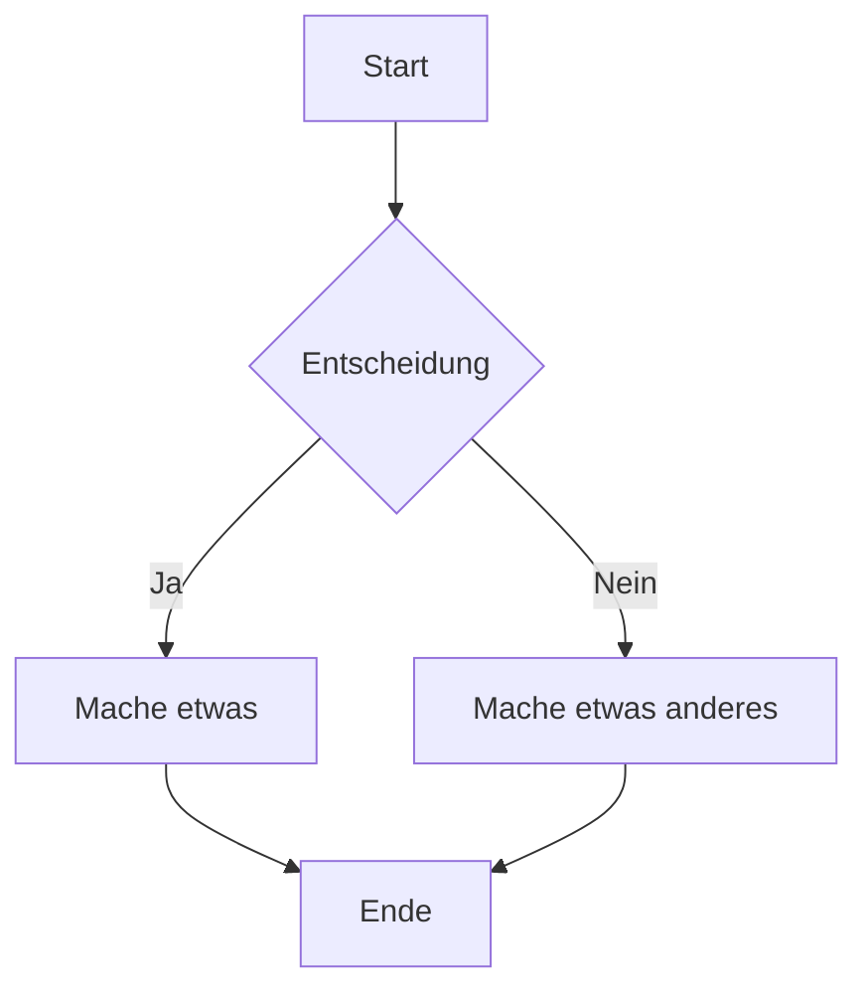

Hier ist eine Demo, wie alles aussieht.

Das folgende Markdown-Cheatsheet ist adaptiert von: [https://guides.github.com/features/mastering-markdown/](https://guides.github.com/features/mastering-markdown/)

# Was ist Markdown?

Markdown ist eine Möglichkeit, Text im Web zu gestalten. Du kontrollierst die Anzeige des Dokuments; Wörter als fett oder kursiv zu formatieren, Bilder hinzuzufügen und Listen zu erstellen sind nur einige der Dinge, die wir mit Markdown tun können. Größtenteils ist Markdown nur normaler Text mit ein paar nicht-alphabetischen Zeichen, wie `#` oder `*`.

# Syntax-Leitfaden

Hier ist eine Übersicht der Markdown-Syntax, die du überall auf GitHub.com oder in deinen eigenen Textdateien verwenden kannst.

## Überschriften

```markdown
# Das ist ein h1-Tag

## Das ist ein h2-Tag

#### Das ist ein h4-Tag
```

# Das ist ein h1-Tag

## Das ist ein h2-Tag

#### Das ist ein h4-Tag

## Hervorhebung

```markdown
_Dieser Text wird kursiv sein_

**Dieser Text wird fett sein**

_Du **kannst** sie kombinieren_
```

_Dieser Text wird kursiv sein_

**Dieser Text wird fett sein**

_Du **kannst** sie kombinieren_

## Listen

### Ungeordnet

```markdown
- Element 1
- Element 2
  - Element 2a
  - Element 2b
```

- Element 1
- Element 2
  - Element 2a
  - Element 2b

### Geordnet

```markdown
1. Element 1
1. Element 2
1. Element 3
   1. Element 3a
   1. Element 3b
```

1. Element 1
2. Element 2
3. Element 3
   1. Element 3a
   2. Element 3b

## Bilder

```markdown

Format: 
```


## Links

```markdown
http://tina.io - automatisch!
[TinaCMS](http://tina.io)
```

[http://tina.io](http://tina.io) - automatisch!
[TinaCMS](http://tina.io)

## Blockzitate

```markdown
Wie Napoleon über den Liger sagte:

> Es ist so ziemlich mein Lieblingstier.
> Es ist wie eine Mischung aus Löwe und Tiger… gezüchtet für seine Fähigkeiten in der Magie.
```

Wie Napoleon über den Liger sagte:

> Es ist so ziemlich mein Lieblingstier.
> Es ist wie eine Mischung aus Löwe und Tiger… gezüchtet für seine Fähigkeiten in der Magie.

## Inline-Code

```markdown
Ich denke, du solltest hier stattdessen ein
`<addr>`-Element verwenden.
```

Ich denke, du solltest hier stattdessen ein
`<addr>`-Element verwenden.

## Syntax-Highlighting

Hier ist ein Beispiel, wie du Syntax-Highlighting mit [GitHub Flavored Markdown](https://help.github.com/articles/basic-writing-and-formatting-syntax/) verwenden kannst:

````markdown
```js:fancyAlert.js
function fancyAlert(arg) {
  if (arg) {
    $.facebox({ div: '#foo' })
  }
}
```
````

Und so sieht es aus - schön gefärbt mit gestylten Code-Titeln!

```js:fancyAlert.js
function fancyAlert(arg) {
  if (arg) {
    $.facebox({ div: '#foo' })
  }
}
```

## Tabellen

Du kannst Tabellen erstellen, indem du eine Liste von Wörtern zusammenstellst und sie mit Bindestrichen `-` (für die erste Zeile) trennst und dann jede Spalte mit einem Pipe `|` trennst:

```markdown
| Erste Überschrift           | Zweite Überschrift           |
| --------------------------- | ---------------------------- |
| Inhalt aus Zelle 1          | Inhalt aus Zelle 2           |
| Inhalt in der ersten Spalte | Inhalt in der zweiten Spalte |
```

| Erste Überschrift           | Zweite Überschrift           |
| --------------------------- | ---------------------------- |
| Inhalt aus Zelle 1          | Inhalt aus Zelle 2           |
| Inhalt in der ersten Spalte | Inhalt in der zweiten Spalte |

## Diagramme

Du kannst Mermaid-Diagramme verwenden, um Flüsse, Sequenzen und andere Diagrammtypen direkt in Markdown zu visualisieren. Hier ist ein Beispiel eines Mermaid-Flussdiagramms:



Gerendert würde dies ein Flussdiagramm erstellen, bei dem Entscheidungen zu verschiedenen Pfaden führen. Mermaid unterstützt auch Sequenzdiagramme, Gantt-Charts, Klassendiagramme und mehr. Für die vollständige Palette der Möglichkeiten, schau dir die Mermaid-Dokumentation an: [https://mermaid-js.github.io/mermaid/](https://mermaid-js.github.io/mermaid/)
