TinaCMS wurde entwickelt, um Content-Ersteller mit einer intuitiven und flexiblen Bearbeitungserfahrung zu stärken, und unsere Markdown-Unterstützung ist keine Ausnahme. Ob du einen einfachen Blog oder eine komplexe Dokumentationsseite verwaltest, TinaCMS integriert Markdown nahtlos und kombiniert die Kraft strukturierter Inhalte mit der Einfachheit der Echtzeit-Bearbeitung. Von Überschriften und Links bis hin zu Bildern und benutzerdefinierter Syntax, TinaCMS sorgt dafür, dass deine Markdown-Dateien einfach zu verwalten und anzupassen sind, während du die vollständige Kontrolle über deine Inhalte behältst.

## Flussdiagramme

Verwende ein Flussdiagramm, um Prozesse, Entscheidungsbäume oder Arbeitsabläufe zu visualisieren. Es ist ideal, um komplexe Systeme zu vereinfachen oder Logik visuell zu erklären.

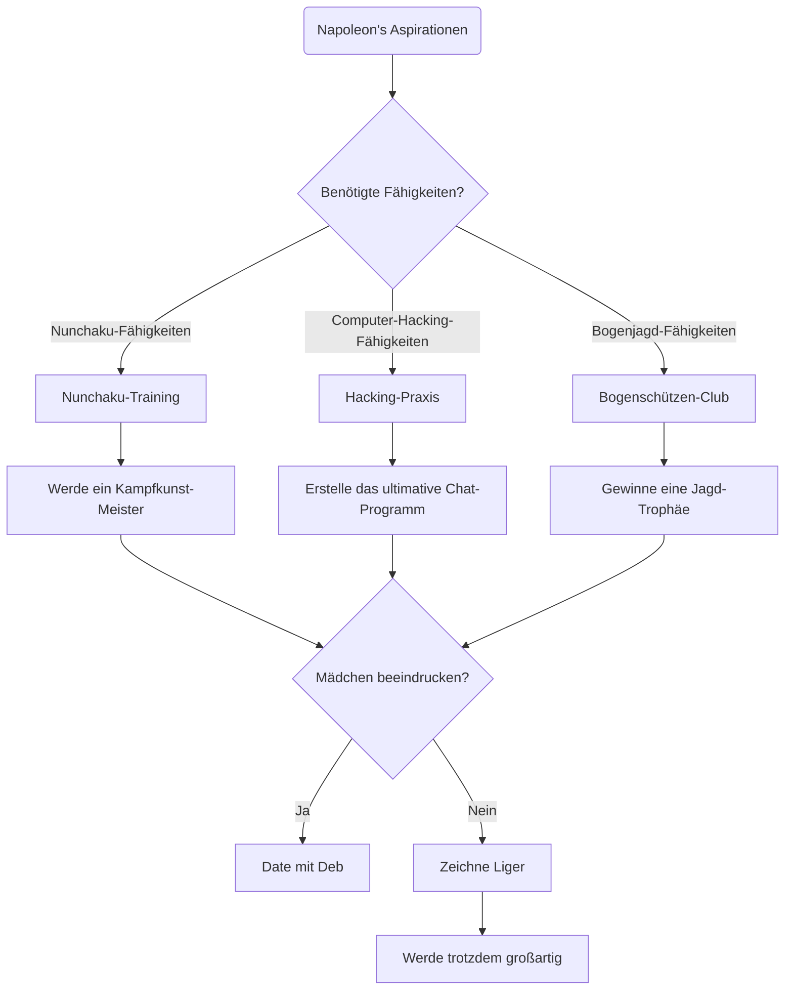

## Sequenzdiagramm

Verwende ein Sequenzdiagramm, um Interaktionen zwischen Komponenten oder Systemen über die Zeit zu veranschaulichen, besonders für APIs, Arbeitsabläufe oder Systeminteraktionen.

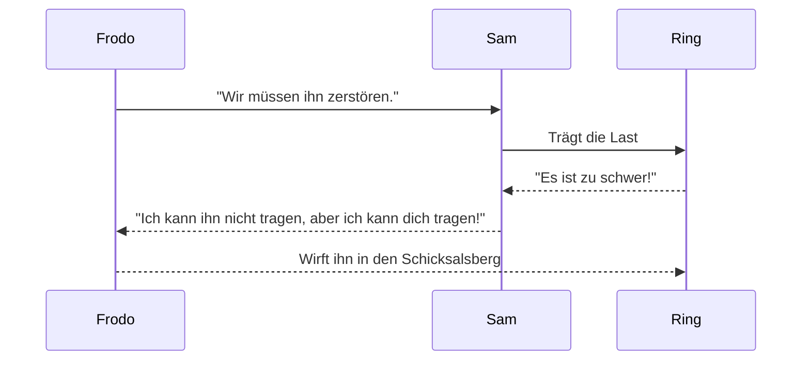

## Klassendiagramm

Verwende ein Klassendiagramm für objektorientiertes Systemdesign, das die Struktur von Klassen, Attributen und ihren Beziehungen zeigt.

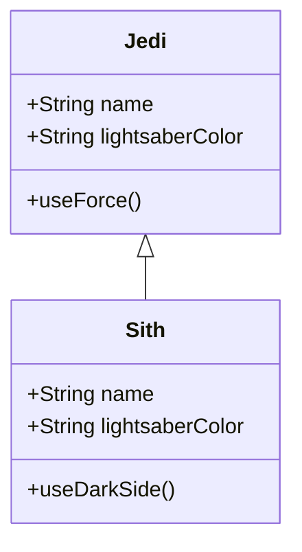

## Zustandsdiagramm

Verwende ein Zustandsdiagramm, um verschiedene Zustände eines Systems oder Objekts und Übergänge zwischen diesen Zuständen darzustellen.

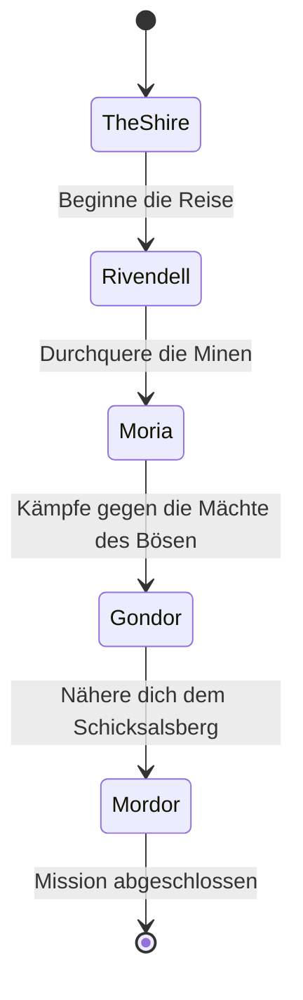

## Entity-Relationship-Diagramm

Verwende ein ER-Diagramm, um Datenbankstrukturen zu modellieren und Entitäten, Attribute und Beziehungen zu zeigen.

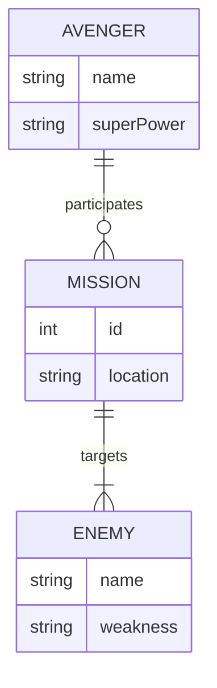

## User Journey

Verwende ein User-Journey-Diagramm, um Benutzerinteraktionen mit deinem Produkt oder Service zu verfolgen und Schmerzpunkte oder Verbesserungsbereiche zu identifizieren.

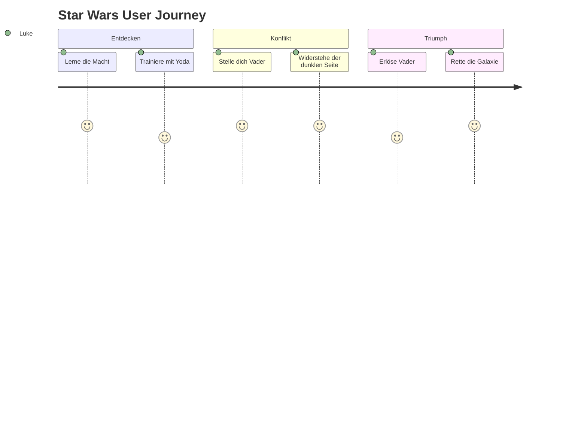

## Gantt-Diagramm

Verwende ein Gantt-Diagramm, um Zeitpläne und Projektpläne zu visualisieren, Fortschritte und Abhängigkeiten zu verfolgen.

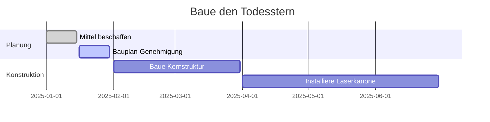

## Kreisdiagramm

Verwende ein Kreisdiagramm, um Datenproportionen visuell darzustellen, wie Ressourcenverteilung oder Umfrageergebnisse.

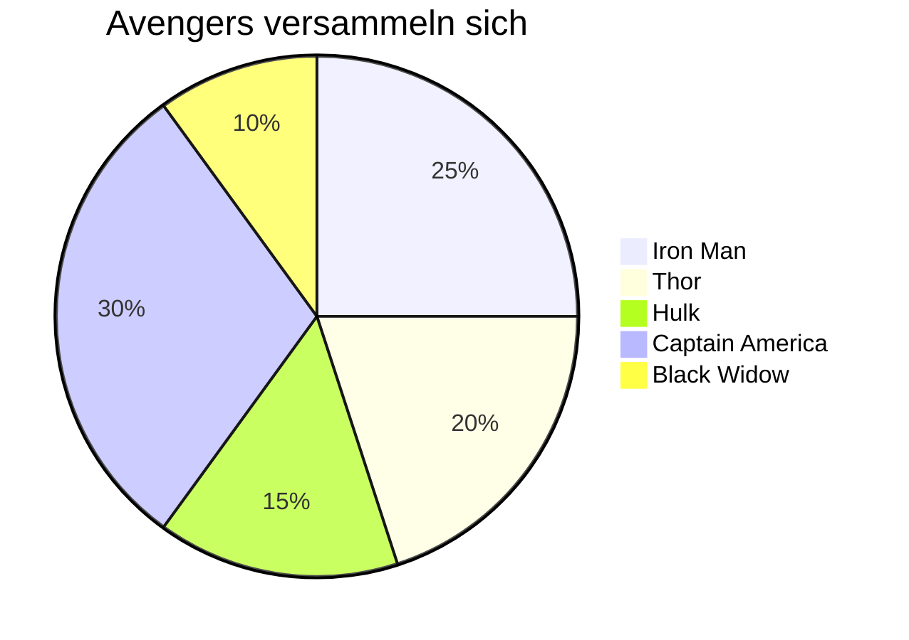

## Quadranten-Diagramm

Verwende ein Quadranten-Diagramm, um Aufgaben zu priorisieren oder Elemente entlang zweier Dimensionen zu visualisieren.

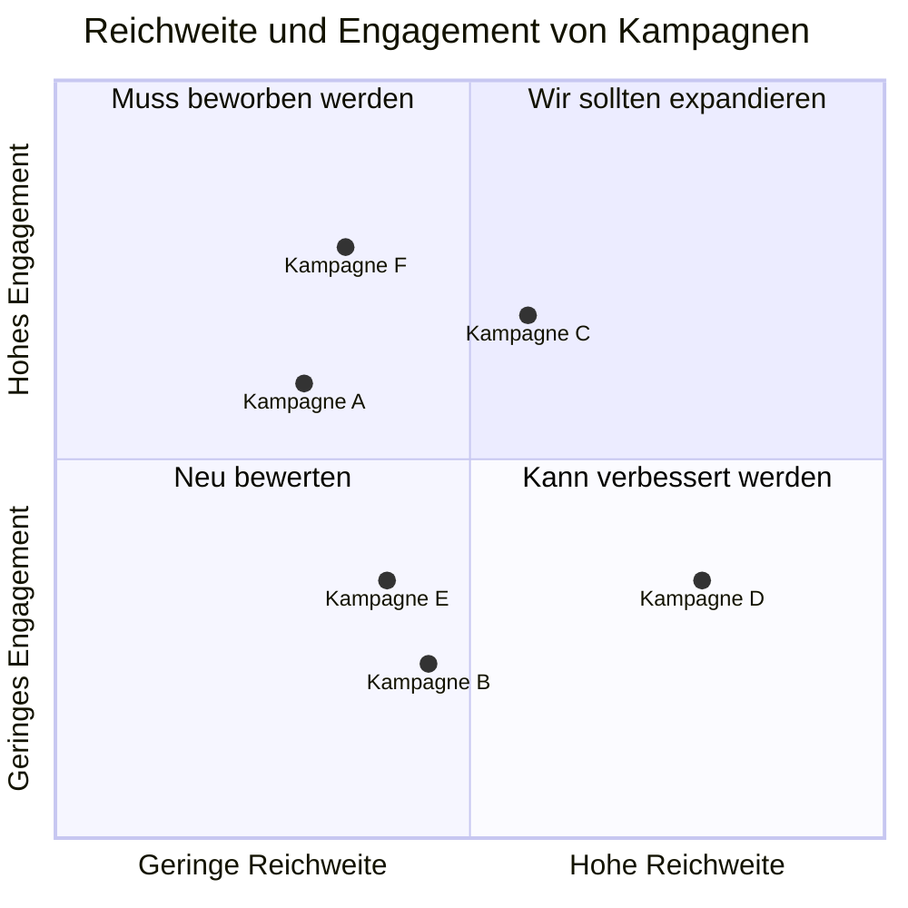

## Requirements-Diagramm

Verwende ein Requirements-Diagramm, um Projektanforderungen und ihre Beziehungen zu verfolgen.

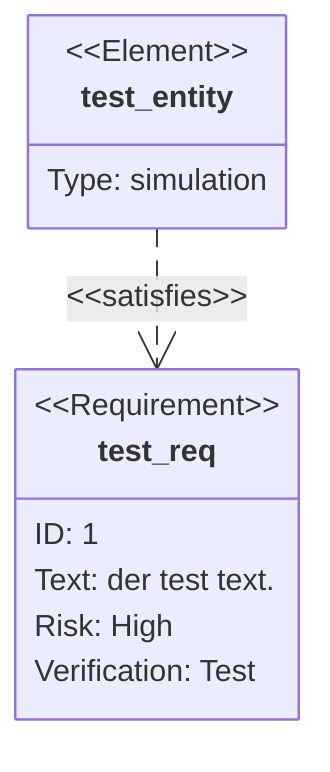

## Gitgraph (Git) Diagramm

Verwende ein Gitgraph-Diagramm, um Git-Workflows und Branching-Strategien zu visualisieren.

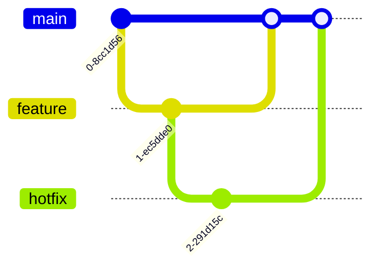

## C4-Diagramm

Verwende ein C4-Diagramm für Software-Architektur, das Systemkontexte, Container, Komponenten und Code zeigt.

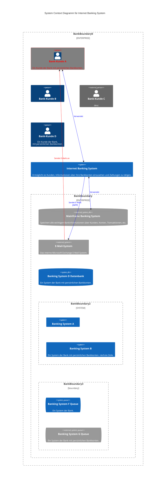

## Mindmaps

Verwende eine Mindmap, um Ideen zu sammeln oder Informationen hierarchisch visuell zu organisieren.

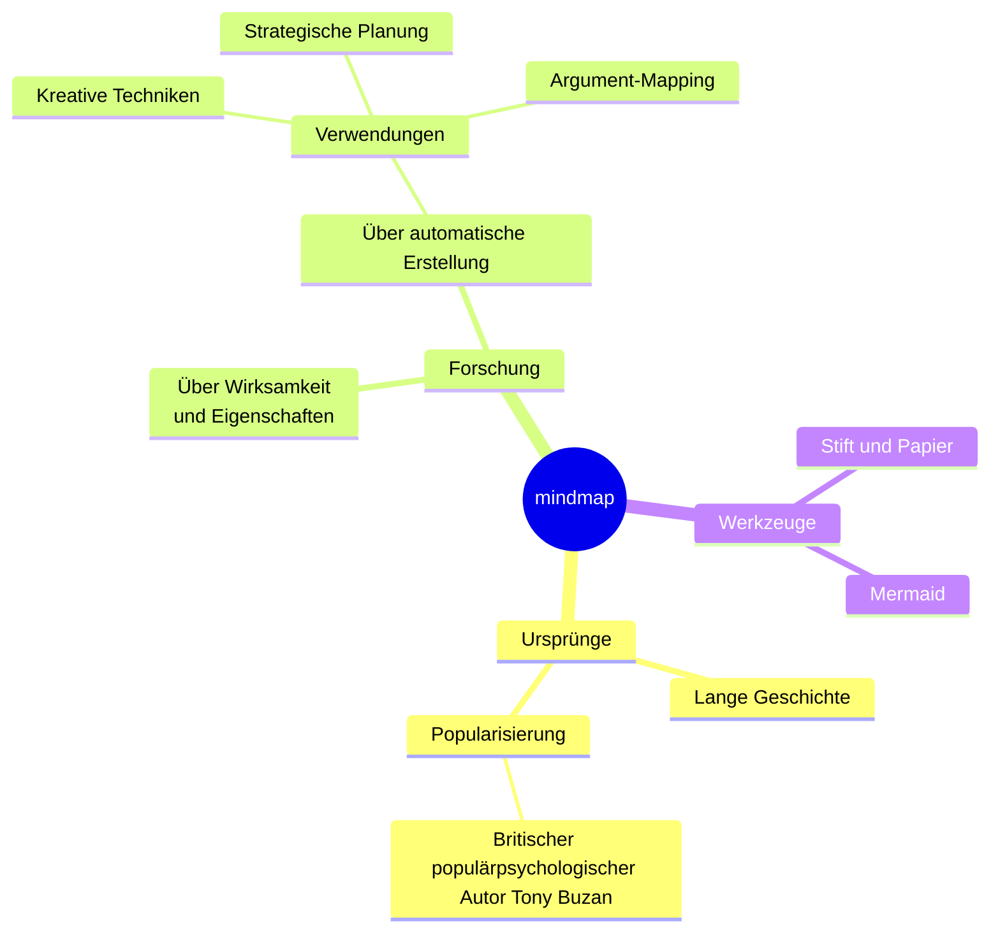

## Timeline

Verwende eine Timeline, um Ereignisse chronologisch zu zeigen, wie Meilensteine oder historische Daten.

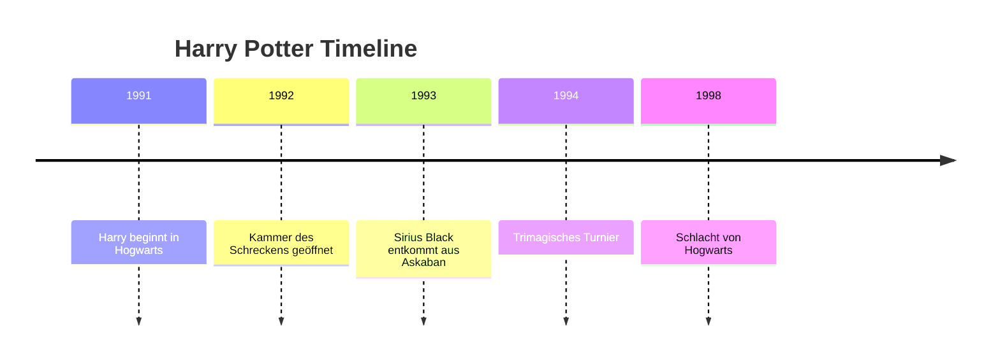

## Sankey-Diagramm

Verwende ein Sankey-Diagramm, um den Fluss von Ressourcen, Energie oder Daten zwischen Stufen zu zeigen.

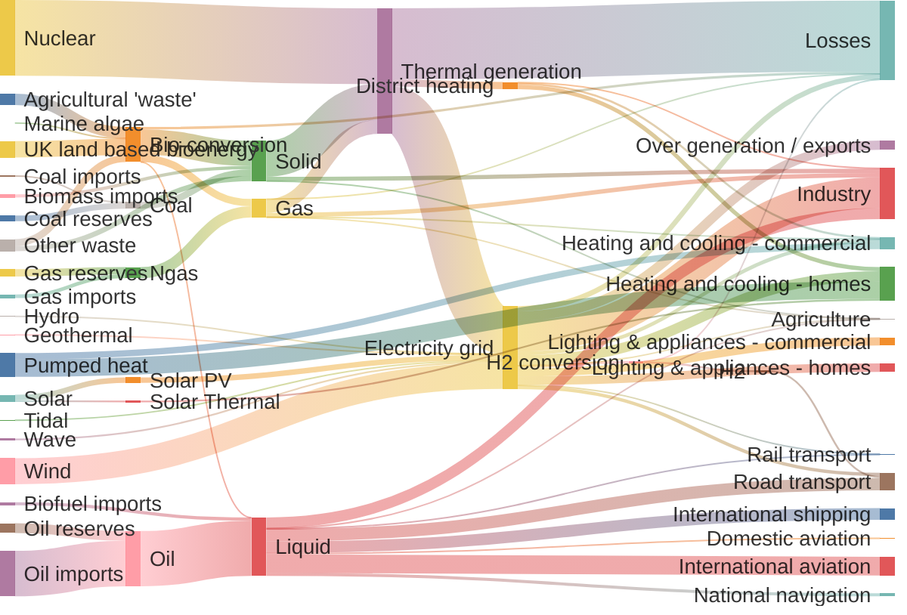

## XY-Diagramm

Verwende ein XY-Diagramm, um Datenpunkte entlang zweier Dimensionen zu vergleichen, wie Leistung vs. Kosten.

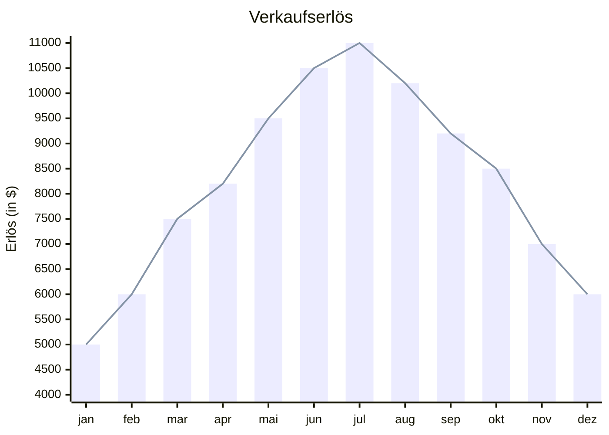

## Packet-Diagramm

Wann verwenden:
Verwende ein Packet-Diagramm, um Netzwerkkommunikation und Datenflüsse zu beschreiben.

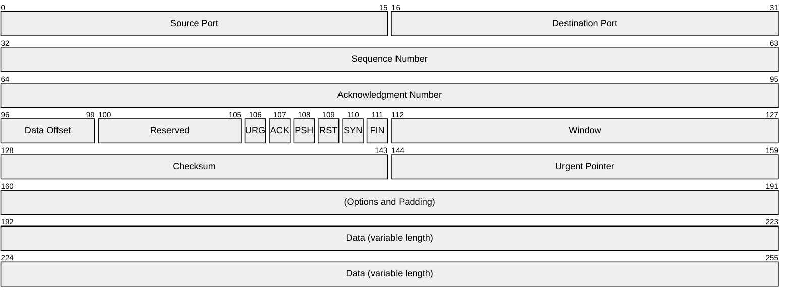

## Kanban

Verwende ein Kanban-Board, um Arbeitselemente und ihre Status in Arbeitsabläufen zu visualisieren.

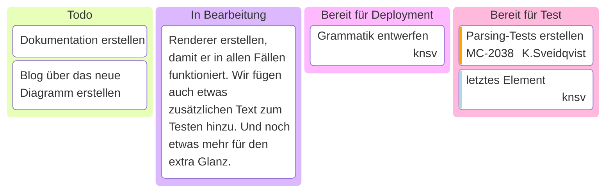

## Architektur-Diagramm

Verwende ein Architektur-Diagramm, um hochrangige Systemkomponenten und ihre Interaktionen darzustellen.

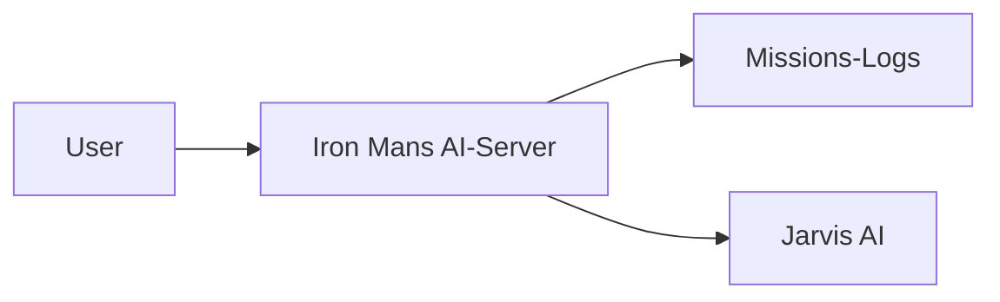
