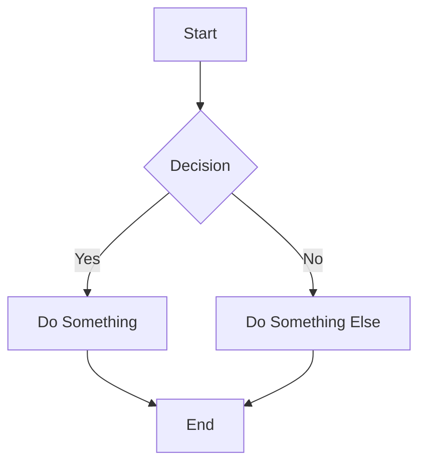

Here's a demo of how everything looks.

The following markdown cheatsheet is adapted from: [https://guides.github.com/features/mastering-markdown/](https://guides.github.com/features/mastering-markdown/)

# What is Markdown?

Markdown is a way to style text on the web. You control the display of the document; formatting words as bold or italic, adding images, and creating lists are just a few of the things we can do with Markdown. Mostly, Markdown is just regular text with a few non-alphabetic characters thrown in, like `#` or `*`.

# Syntax guide

Here’s an overview of Markdown syntax that you can use anywhere on GitHub.com or in your own text files.

## Headers

```markdown
# This is a h1 tag

## This is a h2 tag

#### This is a h4 tag
```

# This is a h1 tag

## This is a h2 tag

#### This is a h4 tag

## Emphasis

```markdown
_This text will be italic_

**This text will be bold**

_You **can** combine them_
```

*This text will be italic*

**This text will be bold**

*You **can** combine them*

## Lists

### Unordered

```markdown
- Item 1
- Item 2
  - Item 2a
  - Item 2b
```

* Item 1
* Item 2
  * Item 2a
  * Item 2b

### Ordered

```markdown
1. Item 1
1. Item 2
1. Item 3
   1. Item 3a
   1. Item 3b
```

1. Item 1
2. Item 2
3. Item 3
   1. Item 3a
   2. Item 3b

## Images

```markdown

Format: 
```


## Links

```markdown
http://tina.io - automatic!
[TinaCMS](http://tina.io)
```

[http://tina.io](http://tina.io) - automatic!
[TinaCMS](http://tina.io)

## Blockquotes

```markdown
As Napoleon said about the liger:

> It’s pretty much my favorite animal.
> It’s like a lion and a tiger mixed… bred for its skills in magic.
```

As Napoleon said about the liger:

> It’s pretty much my favorite animal.
> It’s like a lion and a tiger mixed… bred for its skills in magic.

## Inline code

```markdown
I think you should use an
`<addr>` element here instead.
```

I think you should use an
`<addr>` element here instead.

## Syntax highlighting

Here’s an example of how you can use syntax highlighting with [GitHub Flavored Markdown](https://help.github.com/articles/basic-writing-and-formatting-syntax/):

````markdown
```js:fancyAlert.js
function fancyAlert(arg) {
  if (arg) {
    $.facebox({ div: '#foo' })
  }
}
```
````

And here's how it looks - nicely colored with styled code titles!

```js:fancyAlert.js
function fancyAlert(arg) {
  if (arg) {
    $.facebox({ div: '#foo' })
  }
}
```

## Tables

You can create tables by assembling a list of words and dividing them with hyphens `-` (for the first row), and then separating each column with a pipe `|`:

```markdown
| First Header                | Second Header                |
| --------------------------- | ---------------------------- |
| Content from cell 1         | Content from cell 2          |
| Content in the first column | Content in the second column |
```

| First Header                | Second Header                |
| --------------------------- | ---------------------------- |
| Content from cell 1         | Content from cell 2          |
| Content in the first column | Content in the second column |

## Diagrams

You can use Mermaid diagrams to visualize flows, sequences, and other chart types directly in Markdown. Here’s an example of a Mermaid flowchart:



Rendered, this would create a flowchart where decisions lead to different paths. Mermaid also supports sequence diagrams, Gantt charts, class diagrams, and more. For the full range of possibilities, check out the Mermaid documentation: [https://mermaid-js.github.io/mermaid/](https://mermaid-js.github.io/mermaid/)
