TinaCMS is designed to empower content creators with an intuitive and flexible editing experience, and our markdown support is no exception. Whether you're managing a simple blog or a complex documentation site, TinaCMS seamlessly integrates markdown, combining the power of structured content with the ease of real-time editing. From headings and links to images and custom syntax, TinaCMS ensures your markdown files are easy to manage and customize while maintaining complete control over your content.

## Flowcharts

Use a flowchart to visualize processes, decision trees, or workflows. It’s ideal for simplifying complex systems or explaining logic visually.

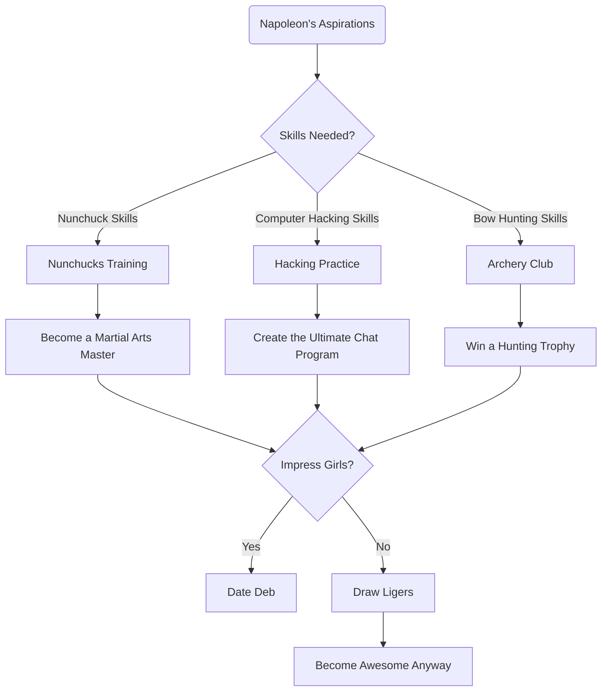

## Sequence Diagram

Use a sequence diagram to illustrate interactions between components or systems over time, particularly for APIs, workflows, or system interactions.

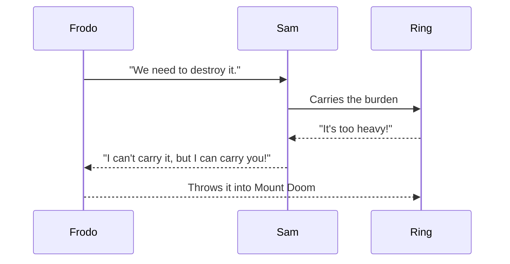

## Class Diagram

Use a class diagram for object-oriented system design, showing the structure of classes, attributes, and their relationships.

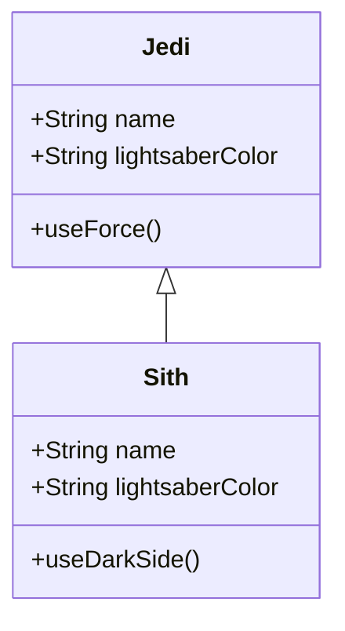

## State Diagram

Use a state diagram to represent different states of a system or object and transitions between those states.

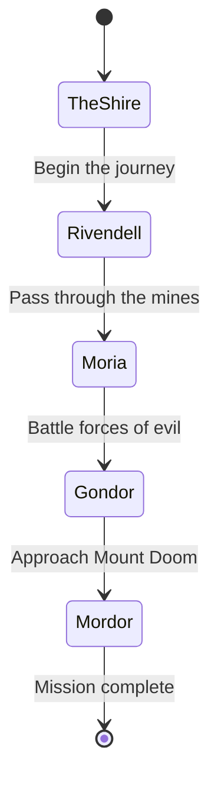

## Entity Relationship Diagram

Use an ER diagram to model database structures, showing entities, attributes, and relationships.

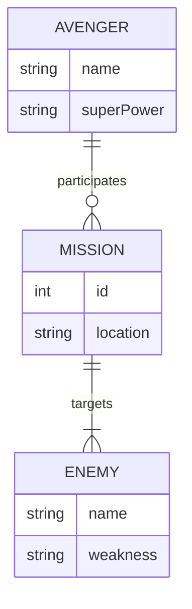

## User Journey

Use a user journey diagram to track user interactions with your product or service and identify pain points or areas for improvement.

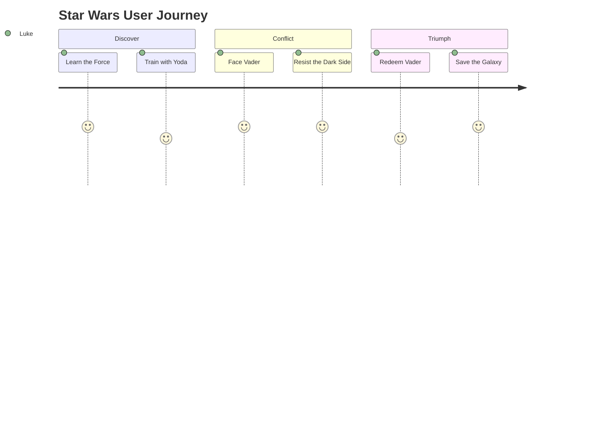

## Gantt Chart

Use a Gantt chart to visualize timelines and project schedules, tracking progress and dependencies.

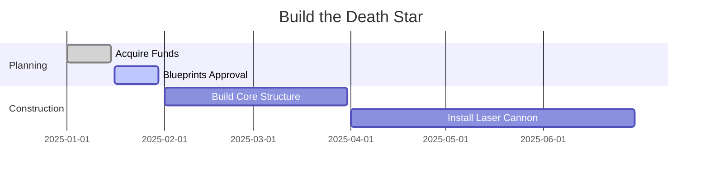

## Pie Chart

Use a pie chart to represent data proportions visually, such as resource allocation or survey results.

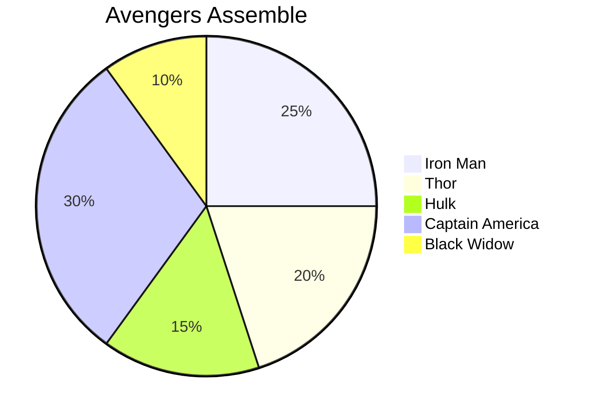

## Quadrant Chart

Use a quadrant chart to prioritize tasks or visualize elements across two dimensions.

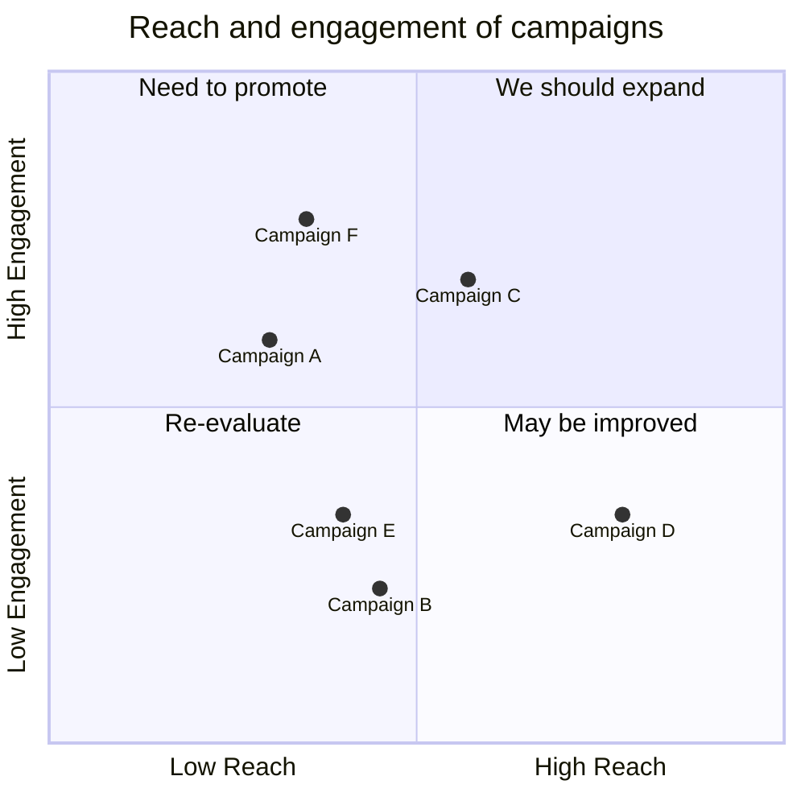

## Requirement Diagram

Use a requirement diagram to track project requirements and their relationships.

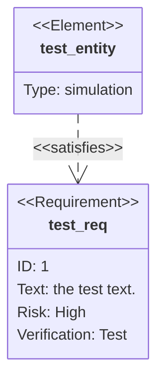

## Gitgraph (Git) Diagram

Use a Gitgraph diagram to visualize Git workflows and branching strategies.

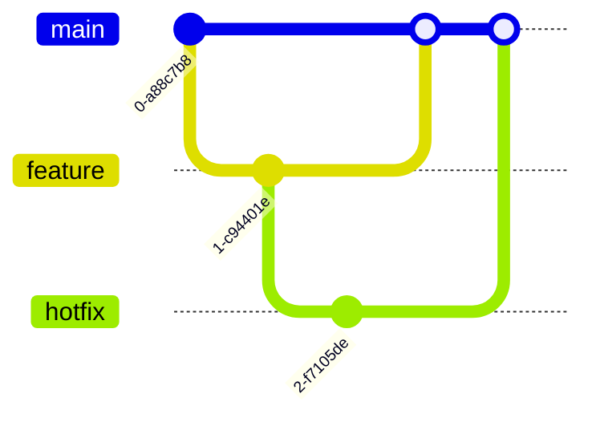

## C4 Diagram

Use a C4 diagram for software architecture, showing system contexts, containers, components, and code.

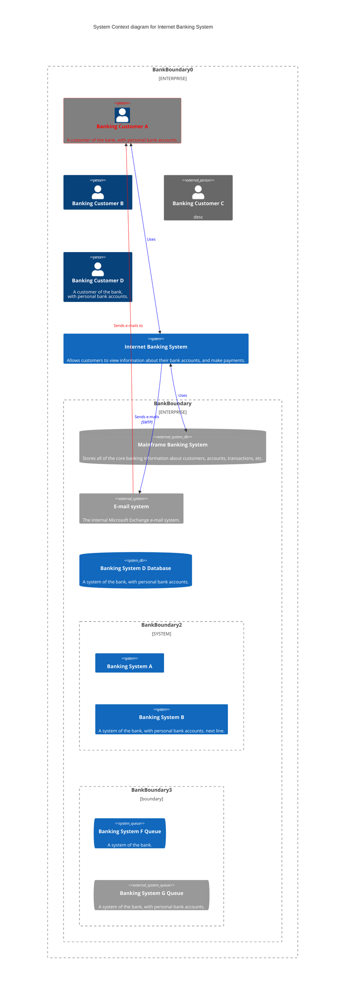

## Mindmaps

Use a mindmap to brainstorm ideas or visually organize information hierarchically.

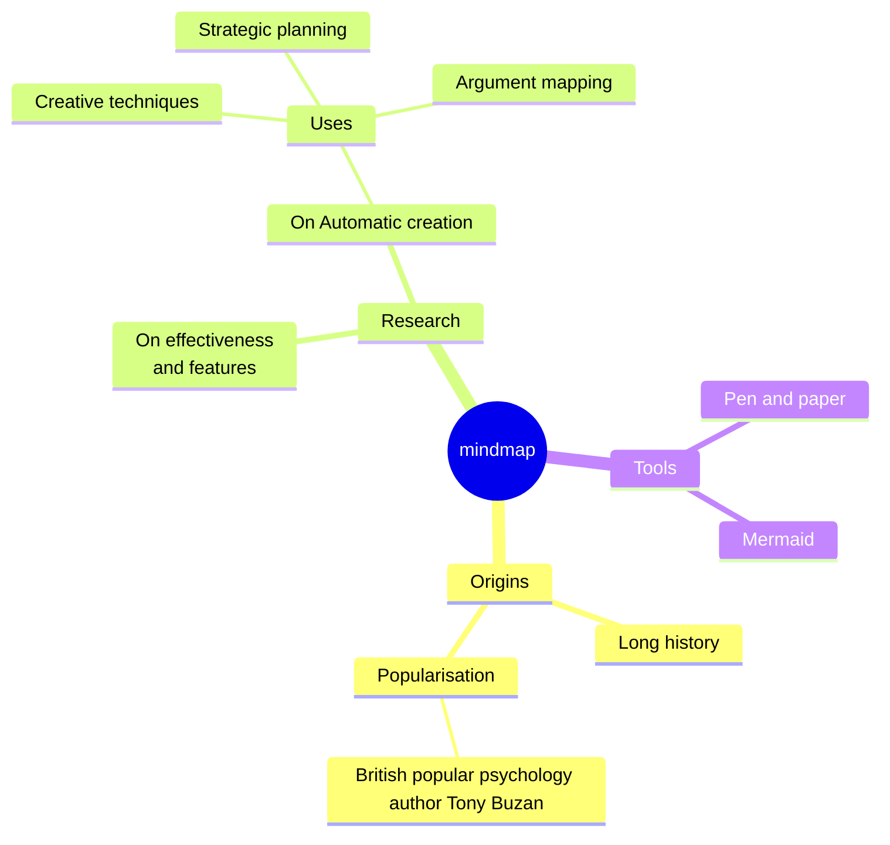

## Timeline

Use a timeline to show events chronologically, such as milestones or historical data.

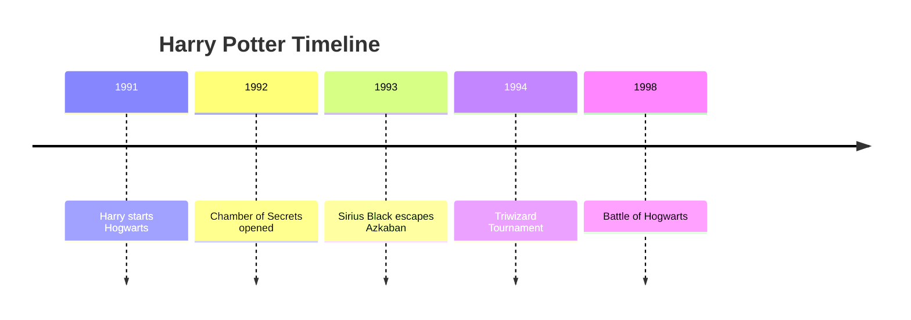

## Sankey Diagram

Use a Sankey diagram to show the flow of resources, energy, or data between stages.

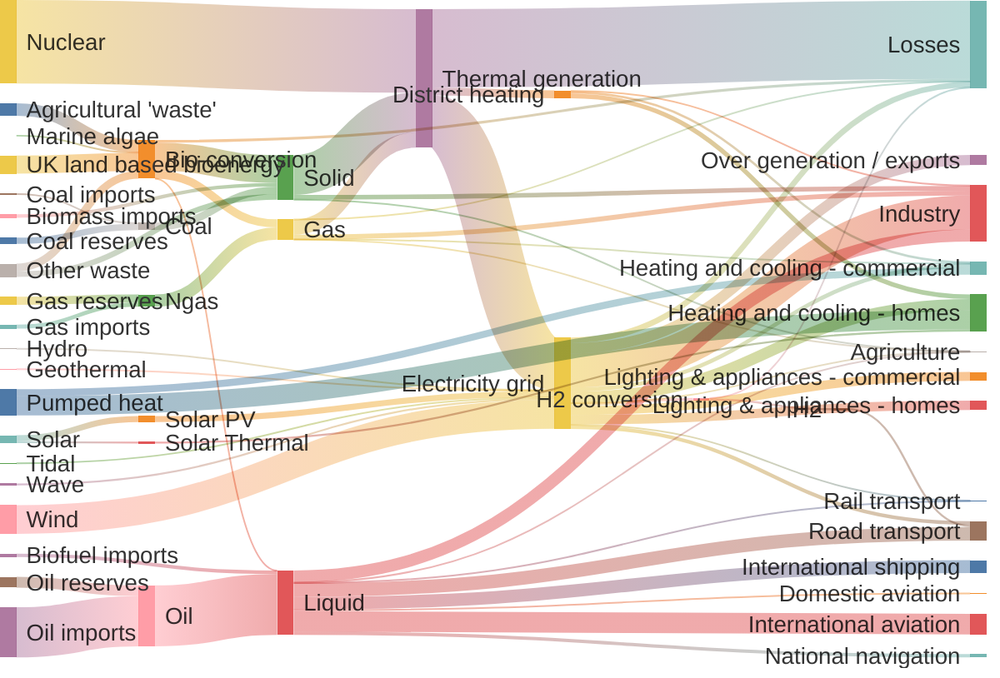

## XY Chart

Use an XY chart to compare data points across two dimensions, such as performance vs. cost.

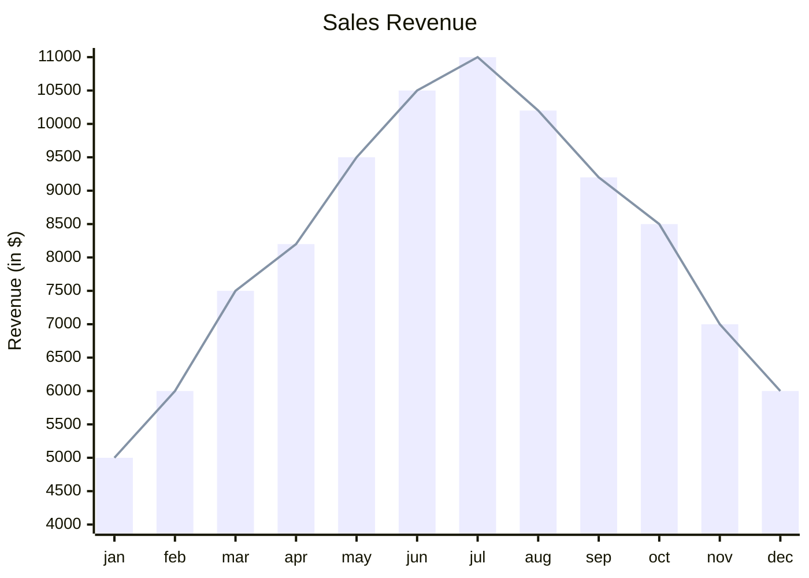

## Packet Diagram

When to use:
Use a packet diagram to describe network communications and data flows.

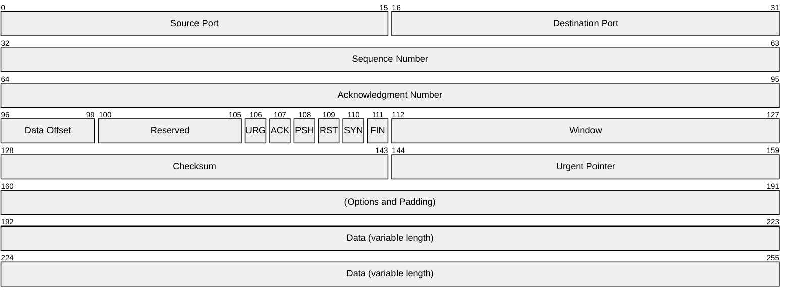

## Kanban

Use a Kanban board to visualize work items and their statuses in workflows.

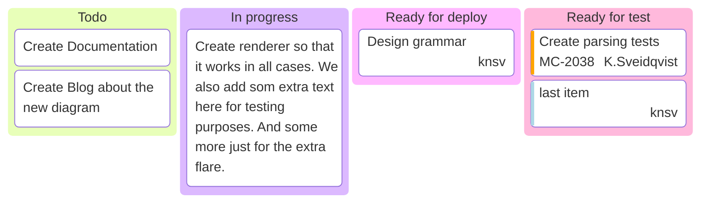

## Architecture Diagram

Use an architecture diagram to represent high-level system components and their interactions.

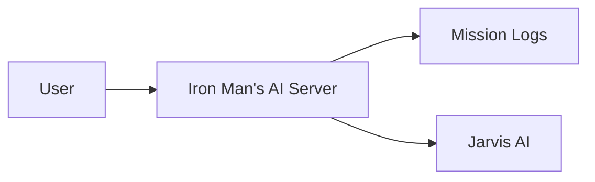
